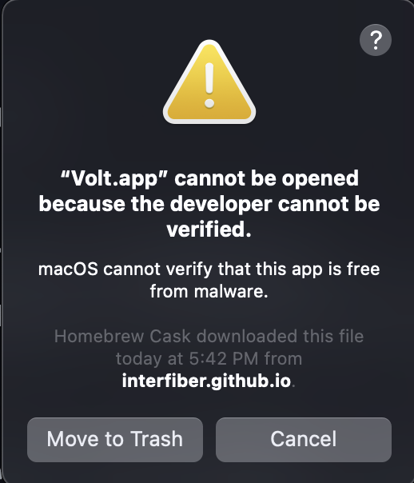
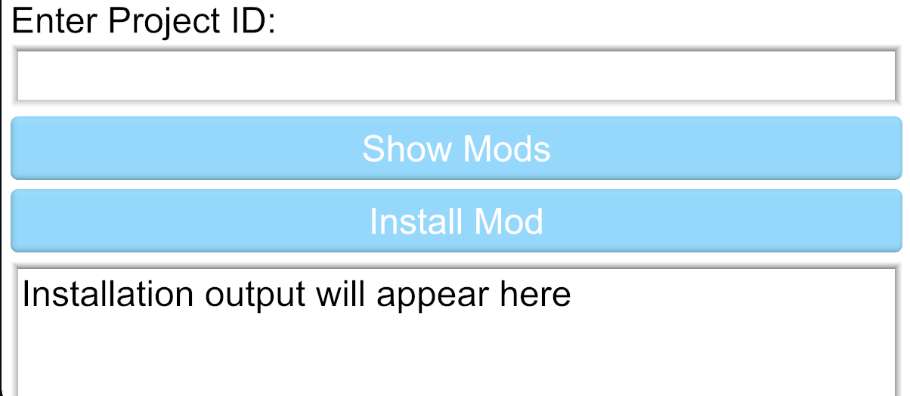
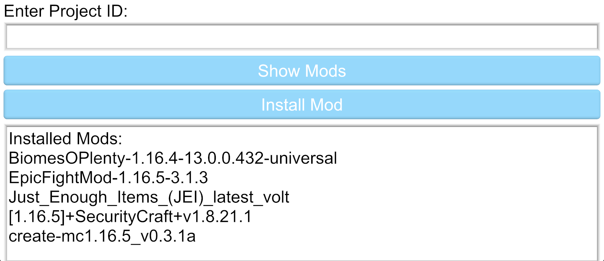
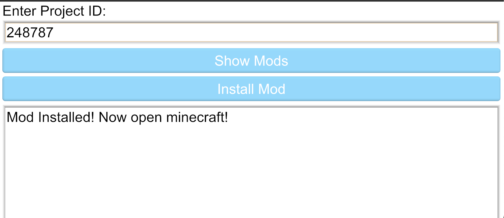

# ⚡️ Volt
Minecraft Forge Plugin Manager

## ℹ️ About
Volt is a [↗️ Forge](https://minecraftforge.net/) plugin manager. It allows you to download and install plugins from [↗️ CurseForge](https://curseforge.com) with ease. This removes the chunk of time where you need to download the mod file, find your minecraft folder, and drop in the jar file.

## 📲 Installation
Below is instructions how to install volt.

### 📦 Package Manager
Volt can be installed via some popular package managers

#### 🍺 Homebrew
Volt can be installed via homebrew with
```bash
brew tap Interfiber/homebrew-tap
brew install --cask voltmc
```

### 💻 From Source
To build volt from source you will need to have [↗️ Rust](https://rust-lang.org) installed with the ```1.52.0``` beta release set as default in [↗️ Rustup](https://rustup.rs). Then download this repo with git and run thw following inside the cloned directory
```bash
cargo build --release
```

### 💾 Manual
For manual install, download the latest release from github. Then open the DMG and drag the app to your Applications folder. If you get a warning like below you will need to allow the app to open in ```System Preferences -> Security And Privacy```.


## 🖼 Screenshots
Below are some screenshots of volt in action!

| Welcome Screen | Mod List | Mod Installation |
|:---:|:---:|:---:|
|  |  |  |

## 📺 Getting Started Videos
Heres some videos I have created to help you get started with volt

[↗️ Volt | Installation for Mac](https://odysee.com)

[↗️ Volt | Installation for Linux](https://odysee.com)

[↗️ Volt | Getting started with mods](https://odysee.com)

[↗️ Volt | Basic Configuration](https://odysee.com)

## 🎮 Installing Mods
Currently volt does not allow you to search mods on curseforge, but this feature is coming. But in the mean time simply search up a mod on curseforge like [↗️  Create](https://www.curseforge.com/minecraft/mc-mods/create). In the ```About Project``` panel copy the project ID. Now open volt and paste in the project id. If a "V" appears at the end, delete it. Now click ```Install Mod```. Then when the process finishes open minecraft and enjoy!

## ⚠️ Known Problems
Below is a list of known problems in volt
   - Will quit when text is selected in a certain way
   - Volt will put a V at the end of any text you paste, this is a problem with the GUI library [kas](https://crates.io/crates/kas)
